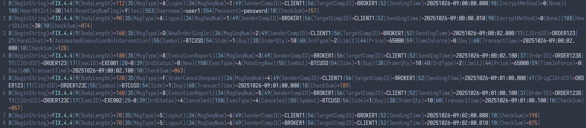
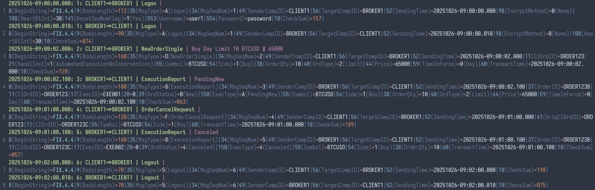
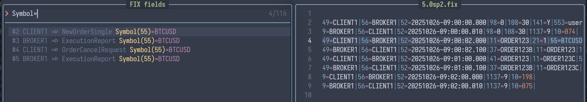

# fix.nvim

Plugin for FIX protocol viewing in Neovim.

## Screenshots





## Features

- Syntax highlighting for FIX messages
- Tag and values annotation
- Easy navigation between fields
- Support for multiple FIX versions
- SOH \x01 character concealing

## Installation

### With lazy.nvim

```lua
{
  "sergluka/fix.nvim",
  dependencies = { "manoelcampos/xml2lua", "ColinKennedy/mega.cmdparse", "ColinKennedy/mega.logging" },
  opts = {
    -- Configuration options here
  }
  build = ":TSUpdate fix",
}
```

## Usage

### Commands

- `:FIX --help` - Show help.
- `:FIX annotations [all, tag, value, message]` - Toggle annotations
- `:FIX picker` - Show fields picker
- `:FIX browse` - Open Onixs tag info page in browser
- `:FIX yank field [--reg=<REGISTER>]` - Yanks annotated field under cursor
- `:FIX yank message [--reg=<REGISTER>]` - Yanks annotated message under cursor

### API

- `require("fix").annotate(scope)` - Annotate current buffer
- `require("fix.snacks").open()` - Show fields picker
- `require("fix").browse_tag_online()` - Open Onixs tag info page in browser
- `require("fix").yank_field(reg)` - Yanks annotated field under cursor
- `require("fix").yank_message(reg)` - Yanks annotated message under cursor

## Configuration

```lua
{
  -- Rules for filetype detection. Corresponds to `vim.filetype.add.filetypes`.
  ft = {
    extensions = { "fix", "fixlog" },
    pattern = { ".*%.fix.txt" },
  },
  annotate = {
    -- Tag annotation
    tag = {
      enabled = true,
      formatter = require("fix.formatters.tag").default,
    },
    -- Value annotation
    value = {
      enabled = true,
      formatter = require("fix.formatters.value").default,
    },
    -- Message (title) annotation
    message = {
      enabled = true,
      position = "above", -- "above" | "below"
      formatter = require("fix.formatters.message").default,
    },
  },
}
```

## Note

Because of an [NVIM limitation](https://github.com/neovim/neovim/issues/16166), the virtual text above the first line is not visible. This can be worked around as follows:

- Adding an empty line at the beginning of the file
- Pressing `C-b` to scroll on top after opening the file
- Using `annotate.message.position = "below"` to display the message title below the message

## Links

- [tree-sitter fix basic parser](https://github.com/sergluka/tree-sitter-fix)
- [FIX repository](https://www.fixtrading.org/standards/fix-repository/)
