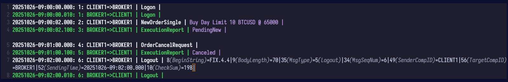
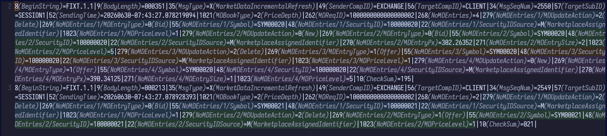
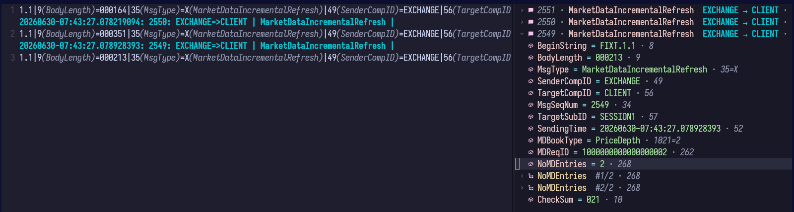

# fix.nvim: FIX Protocol viewer for Neovim

fix.nvim turns raw [Financial Information eXchange (FIX)](https://www.fixtrading.org/standards/)
logs into readable, navigable Neovim buffers. It decodes fields and messages,
shows repeating-group structure, and provides focused tools for exploring and
copying FIX data without changing the source text.

## Limitations

Before using this plugin, consider the following known Neovim limitations:

- <a id="long-fix-line-annotations"></a>On long FIX lines an annotation can be split mid-word across two screen rows, and cursor motions (`w`, `e`, …) may then appear to land inside a label. This is a Neovim bug, not specific to this plugin — see [neovim/neovim#35341](https://github.com/neovim/neovim/issues/35341). Workaround: use `:setlocal nowrap` in FIX buffers and scroll horizontally, or disable field annotations entirely (`annotate.{tag,value}.enabled = false`). You can still explore fields with the [FIX message tree](#fix-message-tree) or `:FIX picker`.
- Virtual lines above the first buffer line are not displayed ([neovim/neovim#16166](https://github.com/neovim/neovim/issues/16166)). Workaround: avoid `annotate.title.position = "above"`.
- On very large files, Neovim's tree-sitter highlighting can freeze the UI when jumping into unparsed regions. Disable highlighting for those buffers with `:lua vim.treesitter.stop(0)`, or let your distribution's big-file protection handle it.

## Features

### Syntax Highlighting and Readability

FIX buffers are detected automatically for `*.fix`, `*.fixlog`, and
`*.fix.txt`. [tree-sitter-fix](https://github.com/sergluka/tree-sitter-fix)
highlights protocol fields and conceals SOH (`\x01`) separators as `|`.

### Annotations and Message Titles

Inline annotations can decode raw tags and enum values without modifying the
buffer. They are disabled by default because of [Nvim limitation](#long-fix-line-annotations) on long FIX lines an
annotation can split across screen rows and disrupt cursor motions. The screenshot shows them enabled.

Message titles remain enabled by default. They summarize each message, color
its session route, and can surround, prefix, or replace the raw line.



Use `:FIX annotations` to toggle tag, value, title, or group annotations.

### Repeating Groups

Repeating groups gain paths such as `NoMDEntries/2/MDEntryPx`; alternating
colors distinguish entries and nested depths.



### FIX Message Tree

The optional Neo-tree source presents messages, fields, and repeating groups as
a hierarchy. Decoded names and values lead each label; raw tags and enum values
remain visible as secondary context.



Register the source in your Neo-tree setup; fix.nvim does not call
`neo-tree.setup()` for you:

```lua
require("neo-tree").setup({
  sources = { "filesystem", "buffers", "git_status", "fix.neo_tree" },
})
```

Open it with `:FIX tree` or `:Neotree fix`. The tree follows the field under the
cursor, loads message fields lazily, and starts group instances collapsed. Its
actions include open/toggle, collapse, refresh, label yank, and online tag
documentation.

### Fields Picker

Run `:FIX picker` from a FIX buffer to search decoded fields and jump directly
to a result. This requires the optional `snacks.nvim` dependency.


Results stream in as large buffers are scanned.

### Custom Dictionaries

fix.nvim bundles `FIX.4.0` through `FIX.5.0SP2`, plus `FIXT.1.1`, and selects
the version from `BeginString` (tag `8`). Add QuickFIX XML or FIX Repository
dictionaries through `setup()`, or switch one for the session with:

```vim
:FIX dictionary xml/custom/binance/spot-fix-oe.xml
:FIX dictionary xml/custom/coinbase/order-entry/FIX42-prod-sand.xml
```

Lua decoders can override tag and enum labels; repository message metadata also
enables repeating-group structure.

### Yank, Browse, and Navigate

`:FIX yank` copies decoded fields or complete messages and supports visual
ranges, Vim operators, and named registers.

`:FIX browse` opens the Onixs documentation page for the tag under the cursor.
Tree-sitter queries expose fields, messages, and comments as text objects for
navigation mappings; fix.nvim intentionally installs no default mappings.

### Customize the Presentation

Formatter hooks control annotations, titles, and tree labels. Filetype rules,
route colors, and plugin highlight groups are also configurable.

## Performance and Internals

fix.nvim renders the viewport first, scans the rest in background batches, and
reuses parsed, decoded, and formatted results. Its size-limited persistent
cache speeds up later sessions; `:FIX cache clear` resets the current file.

## Usage

| Command | Lua API | Description |
| --- | --- | --- |
| `:FIX --help` | | Show command help |
| `:FIX annotations [all|tag|value|title|message|group]` | `require("fix").annotate_toggle(scope)` | Toggle all annotations or one annotation scope (`message` is a legacy alias for `title`) |
| `:FIX picker` | `require("fix.snacks").open()` | Open the fields picker |
| `:FIX tree` | `require("fix.neo_tree").open()` | Open the FIX message tree |
| `:FIX browse` | `require("fix").browse_tag_online()` | Open the Onixs documentation page for the tag under the cursor |
| `:FIX dictionary <PATH>` | `require("fix").use_dictionary(path)` | Use a custom FIX dictionary XML file or repository directory |
| `:FIX yank [--reg=<REGISTER>]` | `require("fix").yank(reg)` | Smart yank: current/selected fields for characterwise targets, selected messages for linewise targets |
| `:FIX cache clear` | `require("fix").cache_clear()` | Clear in-memory and on-disk cache entries for the current file, then re-render |

## Configuration

Pass this table as `opts` for your plugin manager, or pass the same fields to
`require("fix").setup({ ... })`. You only need to set the parts you want to
change. Active values below are defaults; commented values are optional
examples.

```lua
{
  -- Bundled dictionary version used when BeginString (tag 8) is missing or unknown.
  -- Examples: "FIX.4.0", "FIX.4.4", "FIX.5.0SP2", "FIXT.1.1".
  -- "FIXT.1.1" resolves through "FIX.5.0SP2".
  fallback_version = "FIX.4.4",

  -- Optional custom dictionaries keyed by BeginString/FIX version.
  -- Uncomment and adapt entries as needed; the default is an empty table.
  dictionaries = {
    -- ["FIX.4.4"] = {
    --   path = "xml/custom/binance/spot-fix-oe.xml",
    --   mode = "quickfix", -- "auto" | "quickfix" | "repository"
    --   ---@type table<integer, FixTagDecoder>
    --   tags = {
    --     [25035] = function(field, _ctx)
    --       return {
    --         tag_text = "MessageHandling",
    --         value_text = ({ ["1"] = "UNORDERED", ["2"] = "SEQUENTIAL" })[field.value],
    --       }
    --     end,
    --   },
    -- },
    -- ["FIX.4.2"] = "xml/custom/coinbase/order-entry/FIX42-prod-sand.xml",
  },

  -- Filetype detection rules passed to vim.filetype.add().
  ft = {
    extensions = { "fix", "fixlog" },
    pattern = { ".*%.fix.txt" },
  },

  annotate = {
    title = {
        enabled = true,
        position = "replace_front", -- "above" | "below" | "front" | "replace" | "replace_front"
        route = {
          enabled = true,
          mode = "direction", -- "direction" | "sender" | "pair"
          palette = {
            "FixRoute1",
            "FixRoute2",
            "FixRoute3",
            "FixRoute4",
            "FixRoute5",
            "FixRoute6",
            "FixRoute7",
            "FixRoute8",
          },
          overrides = {
            -- { sender = "CLIENT1", target = "*", highlight = "FixClientSend" },
          },
          resolver = nil, -- function(route, message) return "HighlightGroup" end
        },
        formatter = function(message)
          return require("fix.formatters.title").default(message)
        end,
      },
    tag = {
      enabled = false, -- Enable inline tag names (affected by wrapped long lines).
      formatter = function(field)
        return require("fix.formatters.tag").default(field)
      end,
    },
    value = {
      enabled = false, -- Enable inline enum values (affected by wrapped long lines).
      formatter = function(field)
        return require("fix.formatters.value").default(field)
      end,
    },
    group = {
      path = {
        enabled = true, -- Show group paths in field labels.
      },
      highlight = {
        enabled = true, -- Highlight grouped fields.
        target = "both", -- "raw", "annotation", or "both"
        -- Alternate colors by depth and entry.
        palette = {
          "FixGroupDepth1A",
          "FixGroupDepth1B",
          "FixGroupDepth2A",
          "FixGroupDepth2B",
          "FixGroupDepth3A",
          "FixGroupDepth3B",
        },
      },
    },
  },

  cache = {
    persist = {
      enabled = true,
      max_files = 20, -- set false to disable the file-count limit
      max_bytes = 100 * 1024 * 1024, -- set false to disable the total-size limit
      dir = nil, -- defaults to stdpath("cache") .. "/fix.nvim"
    },
  },

  render = {
    debounce_ms = 80,
    lines_per_batch = 500,
    viewport_margin = 50,
  },

  tree = {
    summary = {
      formatter = function(message)
        return require("fix.formatters.tree.summary").default(message)
      end,
    },
    field = {
      formatter = function(field)
        return require("fix.formatters.tree.field").default(field)
      end,
    },
    group = {
      formatter = function(group, field)
        return require("fix.formatters.tree.group").default(group, field)
      end,
    },
  },
}
```

### Keybindings

No keybindings are set by default. Proposed mappings for `ftplugin/fix.lua` or your
Neovim config:

```lua
local fix = require("fix")

local function map(lhs, rhs, desc)
  vim.keymap.set("n", lhs, rhs, { buffer = true, desc = "fix: " .. desc })
end

map("<localleader>t", function()
  fix.annotate_toggle("title")
end, "toggle title annotation")

map("<localleader>T", function()
  fix.annotate_toggle("all")
end, "toggle all annotations")

map("<localleader>x", function()
  fix.browse_tag_online()
end, "open online tag docs")

vim.keymap.set("n", "<localleader>y", function()
  return fix.operator_yank_register("+")
end, {
  expr = true,
  buffer = true,
  desc = "fix: yank target",
})
vim.keymap.set("x", "<localleader>y", function()
  fix.yank("+")
end, {
  buffer = true,
  desc = "fix: yank selection",
})
vim.keymap.set(
  "n",
  "<localleader>yy",
  function() return fix.operator_yank_register("+") .. "_" end,
  { expr = true, buffer = true, desc = "fix: yank line" }
)

map("<localleader><localleader>", function()
  require("fix.snacks").open()
end, "open field picker")
```

Use `fix.operator_yank_register()` without an argument to write to Vim's default
unnamed register. Pass `"+"` or another register name to make that mapping use
a specific register by default.

The following navigation mappings require `nvim-treesitter-textobjects`:

```lua
local ok, ts_move = pcall(require, "nvim-treesitter-textobjects.move")
if not ok then
  ts_move = require("nvim-treesitter.textobjects.move")
end

local function ts_map(lhs, method, query, desc)
  vim.keymap.set({ "n", "x", "o" }, lhs, function()
    ts_move[method](query)
  end, { buffer = true, desc = "fix: " .. desc })
end

ts_map("]]", "goto_next_start", "@field", "next field start")
ts_map("[[", "goto_previous_start", "@field", "previous field start")
ts_map("]}", "goto_next_end", "@field", "next field end")
ts_map("[{", "goto_previous_end", "@field", "previous field end")

ts_map("]m", "goto_next_start", "@message", "next message start")
ts_map("[m", "goto_previous_start", "@message", "previous message start")
ts_map("]M", "goto_next_end", "@message", "next message end")
ts_map("[M", "goto_previous_end", "@message", "previous message end")

ts_map("]g", "goto_next_start", "@comment", "next comment start")
ts_map("[g", "goto_previous_start", "@comment", "previous comment start")
ts_map("]G", "goto_next_end", "@comment", "next comment end")
ts_map("[G", "goto_previous_end", "@comment", "previous comment end")
```

With the yank mapping above, `<localleader>y` behaves like a Vim operator:
type a motion after it to choose the FIX data to yank.

Examples:

```vim
" Yank annotated fields from the cursor through the third next field end.
<localleader>y3]]

" Yank annotated messages covered by the current line and the line below.
<localleader>yj

" Yank annotated fields in the current visual selection.
v...<localleader>y
```

Operator targets such as `]]` must be available in operator-pending mode (`"o"`).
The `ts_map()` helper above uses `{ "n", "x", "o" }` for that reason.

### Filetype Detection

`ft.extensions` and `ft.pattern` are passed to `vim.filetype.add()`. Add entries
here when your FIX logs use project-specific extensions or names. Buffers with
`filetype=fix` are attached automatically.

### Highlight Groups

fix.nvim defines the following highlight groups. Defaults follow
`vim.o.background`; existing user definitions are preserved.

| Group | Dark background | Light background | Used for |
| --- | --- | --- | --- |
| `FixRoute1` | `#4da3ff` | `#005fcb` | Route palette slot 1 |
| `FixRoute2` | `#3ecf5f` | `#007a33` | Route palette slot 2 |
| `FixRoute3` | `#ffb02e` | `#8a5200` | Route palette slot 3 |
| `FixRoute4` | `#c678ff` | `#7a2ebf` | Route palette slot 4 |
| `FixRoute5` | `#00c8d7` | `#007c89` | Route palette slot 5 |
| `FixRoute6` | `#ff5f7a` | `#b00030` | Route palette slot 6 |
| `FixRoute7` | `#f0f3ff` | `#334155` | Route palette slot 7 |
| `FixRoute8` | `#ff7a18` | `#a13f00` | Route palette slot 8 |
| `FixGroupDepth1A` | `#243447` | `#e7f0ff` | Group palette slot 1 |
| `FixGroupDepth1B` | `#243b2f` | `#e6f5ea` | Group palette slot 2 |
| `FixGroupDepth2A` | `#3a2d1f` | `#fff0d8` | Group palette slot 3 |
| `FixGroupDepth2B` | `#332943` | `#f0e8ff` | Group palette slot 4 |
| `FixGroupDepth3A` | `#20383c` | `#e2f6f8` | Group palette slot 5 |
| `FixGroupDepth3B` | `#422630` | `#ffe7ee` | Group palette slot 6 |
| `FixTreeIcon` | `Special` | `Special` | FIX tree node icons |
| `FixTreeName` | `Identifier` | `Identifier` | Decoded message and field names |
| `FixTreeValue` | `String` | `String` | Decoded field values |
| `FixTreeMeta` | `Comment` | `Comment` | Raw tags, values, and scan status |
| `FixTreeOperator` | `Operator` | `Operator` | Tree separators and operators |
| `FixTreeGroup` | `Type` | `Type` | Repeating-group names |

Route groups use bold foreground colors; repeating-group groups use background
colors. Group colors advance by depth and entry, then wrap through the palette.
Tree groups are default links to standard Neovim groups, so colorscheme or user
definitions can override them normally.

The plugin also reuses standard Neovim groups: `Comment` for default tag and
value annotations, `Operator` in the picker, and `IncSearch` for yank feedback.
FIX syntax highlighting uses the standard tree-sitter captures `@comment`,
`@property`, `@operator`, `@normal`, `@constant`, `@number`,
`@punctuation.delimiter`, and `@none`.

### Cache

The persistent cache stores parsed and decoded messages so repeated sessions can
open large logs faster. It lives at `stdpath("cache")/fix.nvim` unless
`cache.persist.dir` is set.

Set `cache.persist.enabled = false` to keep all cache data in memory only.
`max_files` limits the number of cache files, and `max_bytes` limits their total
size. Set either limit to `false` to disable that specific limit. When
persistence is enabled, at least one rotation limit must remain enabled.

### Rendering

Rendering is viewport-first. The visible region, plus `viewport_margin` lines
above and below it, is annotated immediately after the edit debounce. The rest
of the buffer warms the parse/decode cache in `lines_per_batch` chunks.
Off-screen extmarks are not kept around; annotations are re-applied as you
scroll, which keeps large buffers responsive.

`render.debounce_ms` waits briefly after edits before rendering, which avoids
doing repeated work while a file is still changing. `render.lines_per_batch`
controls the background cache warm-up chunk size. Higher values can warm the
cache faster but may make very large files feel less responsive.

## Development

Integration tests run inside a Podman container. The image includes Neovim, the
`tree-sitter-fix` parser, and all Lua dependencies at pinned commit SHAs, so
tests do not need network access at runtime.

```sh
# Build the image on first run and execute the full suite.
./bin/test-integration

# Force a fresh image rebuild after pin updates in Containerfile.
./bin/test-integration --rebuild

# Run one spec file: tests/integration/test_<name>.lua.
./bin/test-integration --filter annotate

# Open a fixture in the test image.
podman run --rm -it --entrypoint nvim \
  -v "$PWD:/plugin:Z" \
  localhost/fix-nvim-test:latest \
  -u tests/integration/minimal_init.lua tests/integration/fixtures/4.4.fix
```

CI runs the same image via `.github/workflows/ci.yml`. Host-side linting still runs with `stylua` and `luacheck`.

## Links

- [tree-sitter-fix parser](https://github.com/sergluka/tree-sitter-fix)
- [FIX Repository](https://www.fixtrading.org/standards/fix-repository/)
