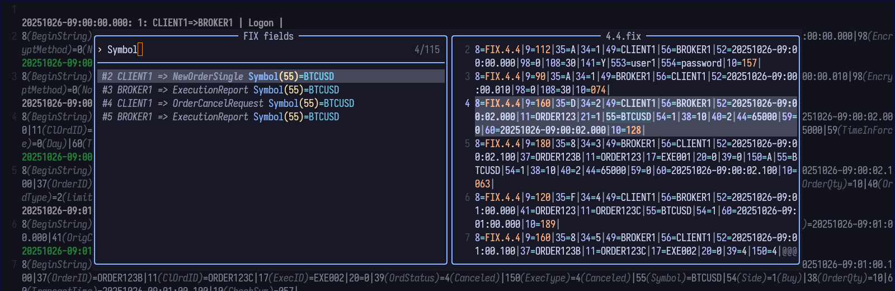

# fix.nvim

A Neovim plugin for viewing [FIX protocol](https://www.fixtrading.org/standards/) messages

---

## Features

- **Syntax highlighting** for FIX messages (via [tree-sitter-fix](https://github.com/sergluka/tree-sitter-fix))
- **Tag and value annotation** with virtual text
- **Easy navigation** between fields and messages
- **Support for multiple FIX versions**
- **SOH (`\x01`) character concealing** for readability
- **Field picker** (optional, with [snacks.nvim](https://github.com/folke/snacks.nvim))

---

## Screenshots




---

## Installation

### [lazy.nvim](https://github.com/folke/lazy.nvim)

```lua
{
  "sergluka/fix.nvim",
  dependencies = {
    "manoelcampos/xml2lua",
    "ColinKennedy/mega.cmdparse",
    "ColinKennedy/mega.logging",
    "folke/snacks.nvim", -- optional, for the fields picker
  },
  opts = {
    -- Configuration options here
  },
  build = ":TSUpdate fix",
}
```

---

## Usage

| Command | Lua API | Description |
|---------|--------------|-------------|
| `:FIX --help` | | Show help |
| `:FIX annotations [all, tag, value, message]` | `require("fix").annotate(scope)` | Toggle annotations |
| `:FIX picker` | `require("fix.snacks").open()` | Show fields picker |
| `:FIX browse` | `require("fix").browse_tag_online()` | Open Onixs tag info page in browser |
| `:FIX yank field [--reg=<REGISTER>]` | `require("fix").yank_field(reg)` | Yank annotated field under cursor |
| `:FIX yank message [--reg=<REGISTER>]` | `require("fix").yank_message(reg)` | Yank annotated message under cursor |

---

## Configuration

```lua
{
  -- Filetype detection rules (see `vim.filetype.add.filetypes`)
  ft = {
    extensions = { "fix", "fixlog" },
    pattern = { ".*%.fix.txt" },
  },
  annotate = {
    -- Tag annotation
    tag = {
      enabled = true,
      formatter = require("fix.formatters.tag").default,
    },
    -- Value annotation
    value = {
      enabled = true,
      formatter = require("fix.formatters.value").default,
    },
    -- Message (title) annotation
    message = {
      enabled = true,
      position = "above", -- "above" | "below"
      formatter = require("fix.formatters.message").default,
    },
  },
}
```

---

## Keybindings

No keybindings are set by default. Example mappings (add to `ftplugin/fix.lua` or your config):

```lua
local fix = require("fix")

vim.keymap.set("n", "<localleader>t", function() fix.annotate_toggle("message") end, { desc = "fix: toggle message annotation", buffer = true })
vim.keymap.set("n", "<localleader>T", function() fix.annotate_toggle("all") end, { desc = "fix: toggle all annotation", buffer = true })
vim.keymap.set("n", "<localleader>x", function() fix.browse_tag_online() end, { desc = "fix: open online doc", buffer = true })
vim.keymap.set("n", "<localleader>yf", function() fix.yank_field("+") end, { desc = "fix: yank field", buffer = true })
vim.keymap.set("n", "<localleader>yy", function() fix.yank_message("+") end, { desc = "fix: yank message", buffer = true })
vim.keymap.set("n", "<localleader><localleader>", function() require("fix.snacks").open() end, { desc = "fix: browse tags", buffer = true })

local ts_move = require("nvim-treesitter.textobjects.move")

vim.keymap.set({ "n", "v" }, "]]", function() ts_move.goto_next_start("@field") end, { desc = "fix: next field start", buffer = true })
vim.keymap.set({ "n", "v" }, "[[", function() ts_move.goto_previous_start("@field") end, { desc = "fix: previous field start", buffer = true })
vim.keymap.set({ "n", "v" }, "]}", function() ts_move.goto_next_end("@field") end, { desc = "fix: next field end", buffer = true })
vim.keymap.set({ "n", "v" }, "[{", function() ts_move.goto_previous_end("@field") end, { desc = "fix: previous field end", buffer = true })

vim.keymap.set({ "n", "v" }, "]m", function() ts_move.goto_next_start("@message") end, { desc = "fix: next message start", buffer = true })
vim.keymap.set({ "n", "v" }, "[m", function() ts_move.goto_previous_start("@message") end, { desc = "fix: previous message start", buffer = true })
vim.keymap.set({ "n", "v" }, "]M", function() ts_move.goto_next_end("@message") end, { desc = "fix: next message end", buffer = true })
vim.keymap.set({ "n", "v" }, "[M", function() ts_move.goto_previous_end("@message") end, { desc = "fix: previous message end", buffer = true })

vim.keymap.set({ "n", "v" }, "]g", function() ts_move.goto_next_start("@comment") end, { desc = "fix: next comment start", buffer = true })
vim.keymap.set({ "n", "v" }, "[g", function() ts_move.goto_previous_start("@comment") end, { desc = "fix: previous comment start", buffer = true })
vim.keymap.set({ "n", "v" }, "]G", function() ts_move.goto_next_end("@comment") end, { desc = "fix: next comment end", buffer = true })
vim.keymap.set({ "n", "v" }, "[G", function() ts_move.goto_previous_end("@comment") end, { desc = "fix: previous comment end", buffer = true })
```

---

## Known Issues

 Due to a [Neovim limitation](https://github.com/neovim/neovim/issues/16166), virtual text above the first line is not displayed, so the first message title may not be visible. Workarounds:

- Add an empty line at the beginning of the file
- Press `C-b` to scroll to the top after opening
- Use `annotate.message.position = "below"` to display the message title below the message

---

## Links

- [tree-sitter-fix parser](https://github.com/sergluka/tree-sitter-fix)
- [FIX repository](https://www.fixtrading.org/standards/fix-repository/)
